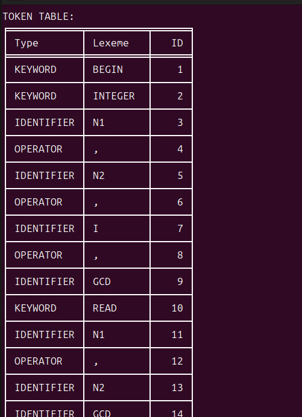
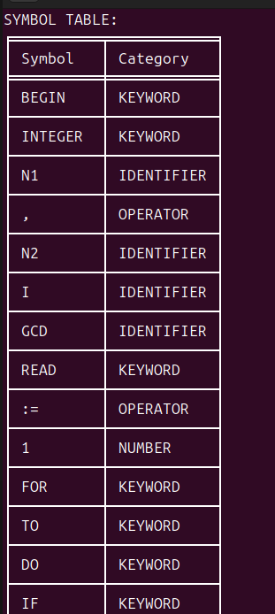
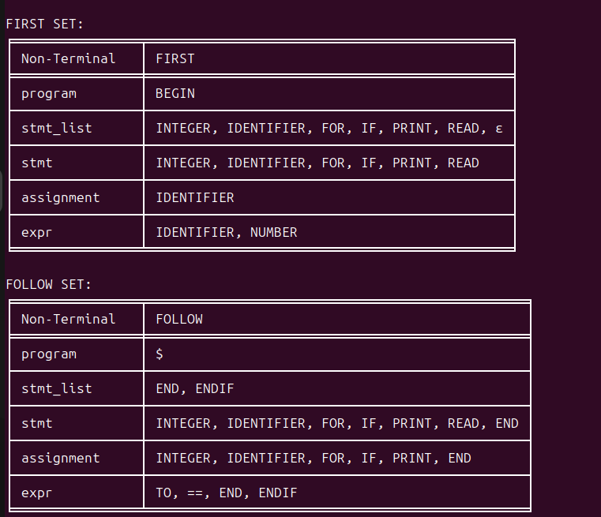

Compiler Project

A Python-based simulation of a basic compiler that demonstrates core phases of compiler design including lexical analysis, syntax handling, and parsing techniques using a GCD-based input program.

---

📌 Overview

This project was developed as part of a **group assignment** to understand how a compiler processes source code step-by-step. It mimics essential compiler phases such as tokenization, symbol table creation, and parsing using a simplified grammar.

---

🚀 Features

- 🔍 **Lexical Analysis**
  - Breaks input into tokens (keywords, identifiers, operators, numbers)
  - Detects invalid tokens

- 📊 **Symbol Table Generation**

- 📐 **FIRST and FOLLOW Sets**

- 🔄 **Shift-Reduce Parsing**

- ❌ **Error Handling**

---

📂 Project Structure

CD-Compiler-Project/
│
├── gcd.py
├── Source input.txt
└── README.md

---

 ▶️ How to Run

1. Install required dependency:

pip install tabulate

2. Run the program:

python3 gcd.py

3. Enter the input manually OR use sample file.

---

🛠️ Technologies Used

- Python  
- Regular Expressions (re)  
- Tabulate Library  

---

👥 Team Contribution

This is a group project completed collaboratively.

- Deeksha  
- Anvitha AV

---

🎯 Learning Outcomes

- Understanding compiler phases  
- Tokenization and parsing basics  
- Grammar implementation  
- Error detection  

---

📌 Future Enhancements

- Add parse tree visualization  
- Support complex grammar  
- Build GUI  
- Improve error handling  

---

📖 Conclusion

This project provides a foundational understanding of compiler design through practical implementation.

---

## 📸 Output Screenshots

### Token Table

### Symbol Table

### FIRST & FOLLOW Sets

